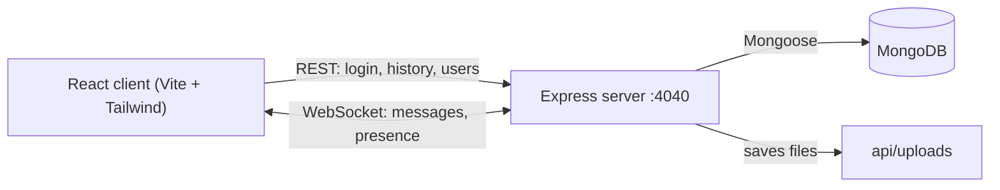

# MernChat — Real-Time Chat App

A full-stack, one-to-one chat application built with the **MERN** stack. Messages are delivered instantly over **WebSockets**, users can see who is online, share files, and pick up conversations where they left off.

## Features

- **Real-time messaging** — messages are pushed instantly over a WebSocket connection and delivered to every tab the recipient has open.
- **Online / offline presence** — a server-side ping/pong heartbeat (every 5 s) detects dropped connections and broadcasts the updated online list to all users.
- **Auto-reconnect** — the client automatically reconnects if the connection drops.
- **File sharing** — send any file in a chat; it is stored on the server and shown as a downloadable link.
- **Persistent chat history** — all messages are stored in MongoDB and loaded when you open a conversation.
- **Secure authentication** — passwords hashed with bcrypt, sessions kept in JWT cookies, and WebSocket connections verified with the same token.
- **Smooth UI** — optimistic message rendering, duplicate filtering, auto-scroll, and a colored avatar for every user.

## Tech Stack

| Layer    | Technologies                                          |
| -------- | ----------------------------------------------------- |
| Frontend | React 18, Vite, Tailwind CSS, Axios, Context API      |
| Backend  | Node.js, Express, `ws` (WebSockets)                   |
| Database | MongoDB (Atlas), Mongoose                             |
| Auth     | JSON Web Tokens (cookies), bcryptjs                   |

## How It Works



- The Express REST API and the WebSocket server share **one HTTP server** on port `4040`.
- On login, the server sets a **JWT cookie**. The same cookie is read during the WebSocket handshake to identify the user.
- When a message is sent, the server saves it to MongoDB and forwards it only to the recipient's open connections.

## Project Structure

```
mern-chat-master/
├── api/                      # Backend
│   ├── models/
│   │   ├── User.js           # username + hashed password
│   │   └── Message.js        # sender, recipient, text, file
│   ├── uploads/              # shared files are saved here
│   └── index.js              # Express REST API + WebSocket server
└── client/                   # Frontend
    └── src/
        ├── Chat.jsx          # main chat screen (contacts, messages, input)
        ├── RegisterAndLoginForm.jsx
        ├── UserContext.jsx   # logged-in user state
        ├── Contact.jsx
        └── Avatar.jsx
```

## Getting Started

### Prerequisites

- [Node.js](https://nodejs.org/) 18 or newer
- [Yarn](https://yarnpkg.com/) (or npm)
- A MongoDB database — a free [MongoDB Atlas](https://www.mongodb.com/cloud/atlas/register) cluster works well

### 1. Clone the repository

```bash
git clone https://github.com/nisarg-r/chatApp.git
cd chatApp
```

### 2. Configure environment variables

Create a file named `.env` inside the `api` folder:

```env
MONGO_URL=mongodb+srv://<username>:<password>@<cluster>.mongodb.net/mern-chat?retryWrites=true&w=majority
JWT_SECRET=<any-long-random-string>
CLIENT_URL=http://localhost:5173
```

| Variable     | Description                                                    |
| ------------ | -------------------------------------------------------------- |
| `MONGO_URL`  | MongoDB connection string (add the database name after `.net/`) |
| `JWT_SECRET` | Secret used to sign login tokens                               |
| `CLIENT_URL` | URL of the frontend, used for CORS                             |

To generate a random `JWT_SECRET`:

```bash
node -e "console.log(require('crypto').randomBytes(32).toString('hex'))"
```

### 3. Install dependencies

```bash
cd api
yarn install
cd ../client
yarn install
```

### 4. Run the app

Start the backend (terminal 1):

```bash
cd api
node index.js
```

Start the frontend (terminal 2):

```bash
cd client
yarn dev
```

Open **http://localhost:5173**.

> **Tip:** To test chatting, register one user in a normal browser window and a second user in an incognito window.

## API Reference

### REST endpoints

| Method | Endpoint             | Description                                  |
| ------ | -------------------- | -------------------------------------------- |
| POST   | `/register`          | Create an account and log in                 |
| POST   | `/login`             | Log in and receive the JWT cookie            |
| POST   | `/logout`            | Clear the JWT cookie                         |
| GET    | `/profile`           | Get the logged-in user from the cookie       |
| GET    | `/people`            | List all users                               |
| GET    | `/messages/:userId`  | Chat history with a user, oldest first       |
| GET    | `/uploads/:filename` | Download a shared file                       |

### WebSocket events

| Direction        | Payload                                            | Purpose                  |
| ---------------- | -------------------------------------------------- | ------------------------ |
| Client → Server  | `{ recipient, text, file? }`                       | Send a message or file   |
| Server → Client  | `{ _id, sender, recipient, text, file }`           | Deliver a new message    |
| Server → Client  | `{ online: [{ userId, username }] }`               | Updated online users     |

## Future Improvements

- Show an error message for wrong login credentials
- Limit file upload size and move files to cloud storage (e.g. S3)
- Move the backend URL into an environment variable for easy deployment
- Typing indicators, read receipts, and group chats
